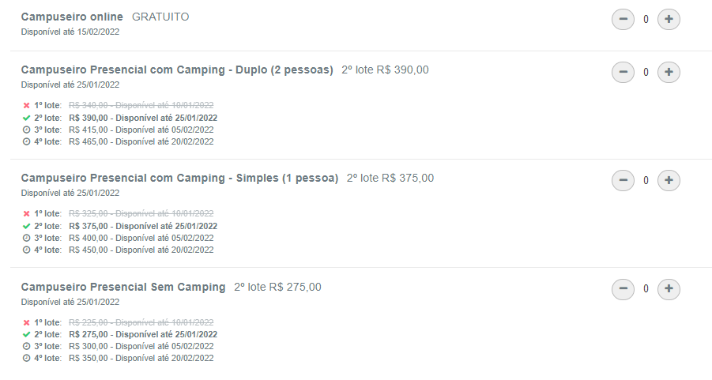

<h1 align="center"> Campus Party </h1>

 Repositório para ajudar pessoas que querer ir a Campus Party, com informações e links. 

<h2 id="hype"> Hype </h2>
<a href="https://www.youtube.com/watch?v=2oQpteSQwkA"> 🔗 Como é a experiência? </a>

<h2 id="onde"> Onde e quando vai ser a prómixa Campus Party? </h2>

 A próxima Campus Party acontecerá no parque de exposições do Anhembi em São Paulo - SP. E vai acontecer do dia 15 ao dia 20 de Fevereiro de 2022.

<h2 id="ingresso"> Onde comprar o ingresso? </h2>

 Você pode comprar o ingresso da Campus Party neste <a href="https://cpbr14.vaitercampus.org/#/"> link </a>. 

 Obs.: O ingresso te dá entrada para os 5 dias do evento. Escolhendo a opção com Camping você terá uma barraca para dormir dentro do Anhembi. 

 Abaixo um print com os valores dos ingressos para cada lote: 

<h4 align="center"> Com o tempo está sendo adicionado mais informações. </h4>
